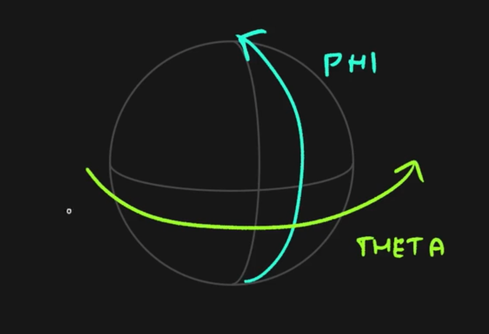

# Three.js Journey

## Notes
- gl_PointSize *= 1.0 / -viewPosition.z;
这个有什么用?
越远的点越小，近的点越大。


- modelMatrix
- viewMatrix
- projectionMatrix

Three.ShaderMaterial 自带上面3个矩阵。
- position 是模型在空间中的位置。自行设置

```glsl
  const geometry = new THREE.BufferGeometry()
  geometry.setAttribute('position', new THREE.Float32BufferAttribute(positionsArray, 3))
```

- 模型矩阵：模型矩阵是用来将模型从局部坐标系转换到世界坐标系的矩阵。
- 视图矩阵：视图矩阵是用来将世界坐标系转换到视图坐标系的矩阵。
- 投影矩阵：投影矩阵是用来将视图坐标系转换到裁剪坐标系的矩阵。
- 位置：位置是模型在空间中的位置。


uResolution 是视图的分辨率。
这个例子里面，点的大小是根据视图的分辨率来设置的。

```js
const sizes = {
    width: window.innerWidth,
    height: window.innerHeight,
    pixelRatio: Math.min(window.devicePixelRatio, 2)
}
sizes.resolution = new THREE.Vector2(sizes.width * sizes.pixelRatio, sizes.height * sizes.pixelRatio)

window.addEventListener('resize', () => {
  // Update sizes
    sizes.width = window.innerWidth
    sizes.height = window.innerHeight

    sizes.pixelRatio = Math.min(window.devicePixelRatio, 2)

    sizes.resolution.set(sizes.width * sizes.pixelRatio, sizes.height * sizes.pixelRatio)

    // Update camera
    camera.aspect = sizes.width / sizes.height
    camera.updateProjectionMatrix()

    // Update renderer
    renderer.setSize(sizes.width, sizes.height)
    renderer.setPixelRatio(sizes.pixelRatio)
})

```
```glsl
gl_PointSize = uSize * uResolution.y;
```

gl_PointCoord 是片元着色器中的一个内置变量，表示当前片元在点上的坐标。




这段代码是在创建球面上的随机点的球面坐标：
```js

    for (let i = 0; i < count; i++) {
        const i3 = i * 3

        const spherical = new THREE.Spherical(
            radius,
            Math.random() * Math.PI,
            Math.random() * Math.PI * 2
        )

        const vector = new THREE.Vector3()

        vector.setFromSpherical(spherical)

        positionsArray[i3 + 0] = vector.x
        positionsArray[i3 + 1] = vector.y
        positionsArray[i3 + 2] = vector.z

        sizesArray[i] = Math.random()
    }

```

这里使用了球面坐标系统，其中：
Math.random() * Math.PI 生成 0 到 π 之间的随机角度（极角）
Math.random() * Math.PI * 2 生成 0 到 2π 之间的随机角度（方位角）
这样的组合可以在球体表面生成均匀分布的随机点，用于创建烟花效果。每个点都会：
有一个固定的半径（radius）
在垂直方向上随机分布（第一个角度）
在水平方向上随机分布（第二个角度）
这是创建3D烟花效果的关键部分，让粒子能够在球形空间中均匀分布。


gsap 是用来控制动画的。

exploding


```glsl
float remap(float value, float originMin, float originMax, float destinationMin, float destinationMax) {
    return destinationMin + (value - originMin) * (destinationMax - destinationMin) / (originMax - originMin);
}
```

remap() 函数是一个非常实用的重映射函数，用于将一个值从一个范围映射到另一个范围。让我们分解这个函数：

在这个着色器中，这个函数被用来控制烟花的爆炸效果，具体是将 uProgress 从 [0.0, 0.1] 的范围映射到 [0.0, 1.0] 的范围，用于平滑地控制爆炸动画。


这两行代码是一个优化性能的技巧，主要用于处理太小的粒子：
```glsl
if(gl_PointSize < 1.0)
    gl_Position = vec4(9999.9);
```
将粒子移动到视野之外
具体解释：
- gl_PointSize < 1.0 检查粒子是否小于1个像素
- 如果粒子太小，就把它的位置设置为 vec4(9999.9)，这个位置在视野范围之外
- 这样做的目的是：
  - 避免渲染那些肉眼看不见的微小粒子
  - 提高性能，因为不需要处理这些看不见的粒子
  - 减少GPU的工作负担
这是一种常见的图形编程优化技巧，特别是在处理粒子系统时很有用。当烟花粒子变得太小时，与其浪费资源去渲染它们，不如直接把它们移出视野范围。
